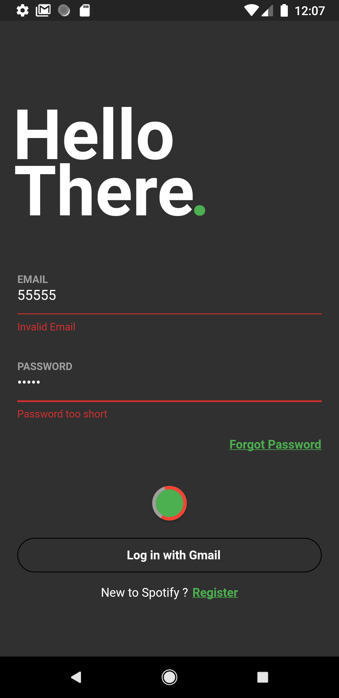
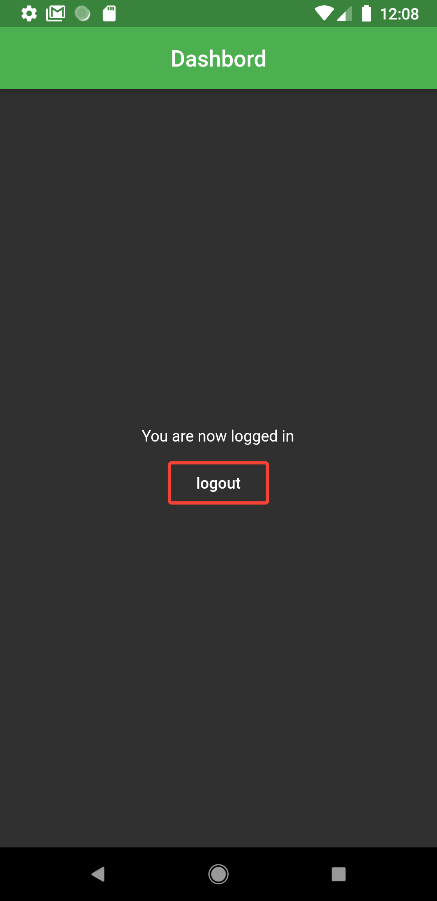
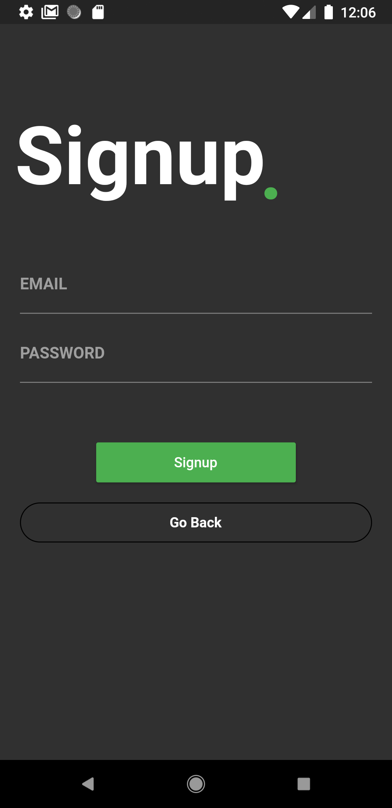
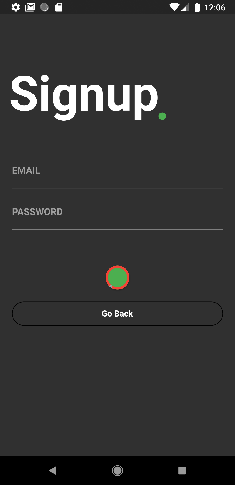

# Login UI & Sign up UI & Firebase & Authintication & Validation & Logout & Loader

Home Page,
Drawer,
Routing Page with pasing data,

### Screenshots
 Login    Validation & Loader                                              Firebase                                           
 Logout    Signup                                                                                       

[Yahya Abu Nada](https://github.com/zaynrix)

## Social links

